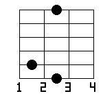
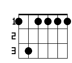
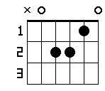
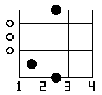
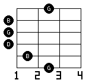
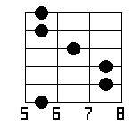
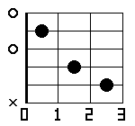
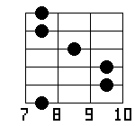

# num2tab

CLI tool to generate guitar chord diagram images.

> 日本語版は [docs/README.ja.md](docs/README.ja.md) をご覧ください。

---

<video src="docs/images/usage.mp4" controls></video>

| G | C `--ox` | F `--notes` | Fm7 `--vertical` |
|---|----------|-------------|------------------|
|  |  |  |  |

---

## Installation

```bash
cargo install --path .
```

Or build directly:

```bash
cargo build --release
./target/release/num2tab --help
```

## Usage

### Basic

```bash
# 6-digit fret input (string 6 → string 1)
num2tab 320003 -o G.png          # G chord
num2tab x32010 -o C.png          # C chord
num2tab x02210 -o Am.png         # Am chord

# Chord name input (auto-selects voicing via CAGED system)
num2tab C -o C.png
num2tab Am -o Am.png
num2tab G7 -o G7.png
```

### Options

| Option | Short | Description |
|--------|-------|-------------|
| `--output FILE` | `-o` | Output file (format detected from extension) |
| `--vertical` | `-v` | Vertical layout (standard chord diagram orientation) |
| `--enable-ox-marker` / `--ox` | | Show o/× open and mute markers |
| `--notes` | `-n` | Show note names on fretted positions instead of dots |
| `--fret N` | `-f` | Starting fret number for display |
| `--caged-c` | `-C` | Use CAGED C shape |
| `--caged-a` | `-A` | Use CAGED A shape |
| `--caged-g` | `-G` | Use CAGED G shape |
| `--caged-e` | `-E` | Use CAGED E shape |
| `--caged-d` | `-D` | Use CAGED D shape |

### Output Formats

Detected automatically from the file extension.

```bash
num2tab C -o C.png    # PNG
num2tab C -o C.jpg    # JPEG
num2tab C -o C.svg    # SVG
```

### `--vertical` / `-v`

```bash
num2tab Am --ox -v -o Am_v.png
```



### `--enable-ox-marker` / `--ox`

Show ○ (open string) and × (muted string) markers.

```bash
num2tab G --ox -o G.png
```



### `--notes` / `-n`

Show note names (C, D#, F# …) instead of dots at fretted and open positions.

```bash
num2tab G --notes --ox -o G_notes.png
```



### `--fret N` / `-f`

Set the starting fret number for high-position chords.

```bash
num2tab 133211 --ox -f 5 -o Barre_F.png
```



### CAGED Shape Selection (`-C` / `-A` / `-G` / `-E` / `-D`)

When using chord name input, specify a CAGED shape to choose the voicing.

```bash
num2tab C -C --ox -o C_Cshape.png   # C shape (open position)
num2tab C -E --ox -o C_Eshape.png   # E shape (high position)
```

| C shape | E shape |
|---------|---------|
|  |  |

## Chord Name Input

You can enter chord names directly. The CAGED system is used to automatically select the optimal voicing.

### Supported Chord Qualities

| Notation | Type | Examples |
|----------|------|---------|
| `C` | Major | C, G, F# |
| `Cm` | Minor | Cm, Am, F#m |
| `C7` | Dominant 7th | C7, G7, D7 |
| `CM7` | Major 7th | CM7, FM7 |
| `Cm7` | Minor 7th | Cm7, Am7 |
| `C9` | Dominant 9th | C9, G9 |
| `CM9` | Major 9th | CM9 |
| `Cm9` | Minor 9th | Cm9 |
| `C11` | Dominant 11th | C11 |
| `CM11` | Major 11th | CM11 |
| `Cm11` | Minor 11th | Cm11 |
| `C13` | Dominant 13th | C13 |
| `Csus2` | Sus2 | Csus2, Gsus2 |
| `Csus4` | Sus4 | Csus4, Gsus4 |
| `Cdim` | Diminished | Cdim, Bdim |
| `Caug` | Augmented | Caug, Eaug |

> **Notation rules**: `M` = Major (uppercase), `m` = minor (lowercase)

## Examples

```bash
# Common chords
num2tab C --ox -o C.png
num2tab Am --ox -o Am.png
num2tab G --ox -o G.png
num2tab F --ox -o F.png

# 7th chords
num2tab G7 --ox -o G7.png
num2tab CM7 --ox -o CM7.png
num2tab Am7 --ox -o Am7.png

# Tension chords
num2tab C9 --ox -o C9.png
num2tab C13 --ox -o C13.png

# Vertical SVG
num2tab Am --ox -v -o Am.svg

# Note names
num2tab G --notes -o G_notes.png
num2tab Am --notes -v -o Am_notes.svg
```

## Dependencies

- [image](https://crates.io/crates/image) 0.25
- [imageproc](https://crates.io/crates/imageproc) 0.25
- [clap](https://crates.io/crates/clap) 4
