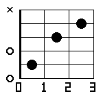
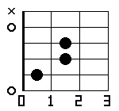
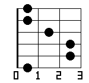
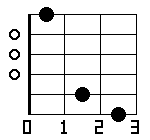
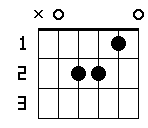

# num2tab

ギターコードダイアグラム画像を生成する CLI ツールです。

## インストール

```bash
cargo install --path .
```

または直接ビルド:

```bash
cargo build --release
./target/release/num2tab --help
```

## 使い方

### 基本

```bash
# 6桁フレット番号で入力（6弦→1弦）
num2tab 320003 -o G.png          # G コード
num2tab x32010 -o C.png          # C コード
num2tab x02210 -o Am.png         # Am コード

# コード名で入力（CAGEDシステムで自動選択）
num2tab C -o C.png
num2tab Am -o Am.png
num2tab G7 -o G7.png
```

### オプション

| オプション | 短縮 | 説明 |
|-----------|------|------|
| `--output FILE` | `-o` | 出力ファイル（拡張子で形式判定） |
| `--vertical` | `-v` | 縦向き表示（標準コードダイアグラム形式） |
| `--enable-ox-marker` / `--ox` | | o/× マーカーを表示 |
| `--fret N` | `-f` | 表示開始フレット番号 |
| `--caged-c` | `-C` | CAGED C 形状を使用 |
| `--caged-a` | `-A` | CAGED A 形状を使用 |
| `--caged-g` | `-G` | CAGED G 形状を使用 |
| `--caged-e` | `-E` | CAGED E 形状を使用 |
| `--caged-d` | `-D` | CAGED D 形状を使用 |

### 出力形式

ファイル拡張子で自動判定します。

```bash
num2tab C -o C.png    # PNG
num2tab C -o C.jpg    # JPEG
num2tab C -o C.svg    # SVG
```

### 表示方向

```bash
# 横向き（デフォルト）: 弦が横、フレットが縦
num2tab 320003 --ox -o G.png

# 縦向き: 弦が縦、フレットが横
num2tab 320003 --ox -v -o G_v.png
```

### o/× マーカー

```bash
num2tab x32010 --ox -o C.png    # ○（開放弦）と ×（ミュート弦）を表示
```

### ハイポジション（--fret）

```bash
# 5フレット目から表示
num2tab 133211 --ox -f 5 -o Barre_F.png
```

## コード名入力

アルファベットのコード名を直接入力できます。CAGEDシステムで最適な運指を自動選択します。

### 対応するコード品質

| 記法 | 種類 | 例 |
|------|------|----|
| `C` | Major | C, G, F# |
| `Cm` | Minor | Cm, Am, F#m |
| `C7` | Dominant 7th | C7, G7, D7 |
| `CM7` | Major 7th | CM7, FM7 |
| `Cm7` | Minor 7th | Cm7, Am7 |
| `C9` | Dominant 9th | C9, G9 |
| `CM9` | Major 9th | CM9 |
| `Cm9` | Minor 9th | Cm9 |
| `C11` | Dominant 11th | C11 |
| `CM11` | Major 11th | CM11 |
| `Cm11` | Minor 11th | Cm11 |
| `C13` | Dominant 13th | C13 |
| `Csus2` | Sus2 | Csus2, Gsus2 |
| `Csus4` | Sus4 | Csus4, Gsus4 |
| `Cdim` | Diminished | Cdim, Bdim |
| `Caug` | Augmented | Caug, Eaug |

> **記法ルール**: `M` = Major（大文字）、`m` = minor（小文字）

### CAGED 形状指定

コード名入力時に `-C`/`-A`/`-G`/`-E`/`-D` で形状を指定できます（6桁入力では無効）。

```bash
num2tab C --ox -o C_best.png    # 自動最適選択
num2tab C -C --ox -o C_Cshape.png
num2tab C -A --ox -o C_Ashape.png
num2tab C -E --ox -o C_Eshape.png   # ハイポジション
```

## 例

```bash
# よく使うコード
num2tab C --ox -o C.png
num2tab Am --ox -o Am.png
num2tab G --ox -o G.png
num2tab F --ox -o F.png

# 7th コード
num2tab G7 --ox -o G7.png
num2tab CM7 --ox -o CM7.png
num2tab Am7 --ox -o Am7.png

# テンションコード
num2tab C9 --ox -o C9.png
num2tab C13 --ox -o C13.png

# 縦向き SVG
num2tab Am --ox -v -o Am.svg
```

## サンプル出力

### 横向き（デフォルト）

| C | Am | G | F | G7 |
|---|----|----|---|-----|
|  |  |  |  |  |

### 縦向き（`--vertical`）



## 依存クレート

- [image](https://crates.io/crates/image) 0.25
- [imageproc](https://crates.io/crates/imageproc) 0.25
- [clap](https://crates.io/crates/clap) 4
