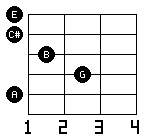
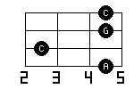

# num2tab

ギターコードダイアグラム画像を生成する CLI ツールです。

> English version: [README.md](../README.md)

---


| G | C `--ox` | F `--notes` | Fm7 `--vertical` | A9 `--tuning "DAEAC#E" --notes` | Am7 `--strings 4 --notes` |
|---|----------|-------------|------------------|----------------------------------|---------------------------|
|  |  |  |  |  |  |

---

## インストール

```bash
cargo install --path .
```

または直接ビルド:

```bash
cargo build --release
./target/release/num2tab --help
```

## 使い方

### 基本

```bash
# 6桁フレット番号で入力（6弦→1弦）
num2tab 320003 -o G.png          # G コード
num2tab x32010 -o C.png          # C コード
num2tab x02210 -o Am.png         # Am コード

# コード名で入力（CAGEDシステムで自動選択）
num2tab C -o C.png
num2tab Am -o Am.png
num2tab G7 -o G7.png
```

### オプション

| オプション | 短縮 | 説明 |
|-----------|------|------|
| `--output FILE` | `-o` | 出力ファイル（拡張子で形式判定） |
| `--vertical` | `-v` | 縦向き表示（標準コードダイアグラム形式） |
| `--enable-ox-marker` / `--ox` | | o/× マーカーを表示 |
| `--notes` | `-n` | 押弦位置のドットを音名に置き換えて表示 |
| `--fret N` | `-f` | 表示開始フレット番号 |
| `--caged-c` | `-C` | CAGED C 形状を使用 |
| `--caged-a` | `-A` | CAGED A 形状を使用 |
| `--caged-g` | `-G` | CAGED G 形状を使用 |
| `--caged-e` | `-E` | CAGED E 形状を使用 |
| `--caged-d` | `-D` | CAGED D 形状を使用 |
| `--tuning NOTES` | | 代替／カスタムチューニング（例: `DAEAC#E`） |
| `--strings N` | | 弦の本数（デフォルト: 6） |
| `--list [N\|all]` | | ボイシング候補を一覧表示（画像出力なし、デフォルト: 5件） |
| `--voicing N` | | N番目のボイシングを選択（1始まり） |

### 出力形式

ファイル拡張子で自動判定します。

```bash
num2tab C -o C.png    # PNG
num2tab C -o C.jpg    # JPEG
num2tab C -o C.svg    # SVG
```

### 自動命名

`--output` を省略すると、入力値からファイル名が自動決定されます: `<入力値>.png`。
ファイル名に使えない文字（`/ \ : * ? " < > |`）は `_` に置換されます。

```bash
num2tab G           # → G.png
num2tab Am7         # → Am7.png
num2tab 320003      # → 320003.png
```

### `--vertical` / `-v`

```bash
num2tab Am --ox -v -o Am_v.png
```


### `--enable-ox-marker` / `--ox`

開放弦（○）とミュート弦（×）マーカーを表示します。

```bash
num2tab G --ox -o G.png
```


### `--notes` / `-n`

押弦位置・開放弦の音名（C, D#, F# …）をドットの代わりに表示します。

```bash
num2tab G --notes --ox -o G_notes.png
```


### `--fret N` / `-f`

ハイポジションコードの表示開始フレットを指定します。

```bash
num2tab 133211 --ox -f 5 -o Barre_F.png
```


### `--tuning NOTES`

代替チューニングやカスタムチューニングを指定します。最低弦から開放弦の音名を並べて指定します（例: オープンAチューニング `DAEAC#E`）。

```bash
num2tab --tuning "DAEAC#E" A9 --notes -o tuning_A9.png
```


### `--strings N`

弦の本数を指定します（デフォルト: 6）。ベースギターなどに使用できます。

```bash
num2tab --strings 4 Am7 --notes -o strings4_Am7.png
```


### CAGED 形状指定（`-C` / `-A` / `-G` / `-E` / `-D`）

コード名入力時に CAGED 形状を指定してボイシングを選択できます。

```bash
num2tab C -C --ox -o C_Cshape.png   # C 形状（ローポジ）
num2tab C -E --ox -o C_Eshape.png   # E 形状（ハイポジ）
```

| C 形状 | E 形状 |
|--------|--------|
|  |  |

### ボイシング選択（`--list` / `--voicing`）

コード名入力時に、スコア順の候補一覧を確認して選択できます。

```bash
# 上位5件を表示（デフォルト）
num2tab Am --list

# N件表示
num2tab G7 --list 3

# 全件表示
num2tab C --list all
```

出力形式:
```
1: x02210  score=121  (pos=0)
2: 133111  score=102  (pos=4)
3: x13321  score=73   (pos=11)
```

`score` は弾きやすさスコア（高いほど弾きやすい）、`pos` は最低フレット位置です。

候補が決まったら番号で指定して画像生成:

```bash
num2tab Am --voicing 2 -o Am2.png
```

> `--voicing` と `--caged-*` は同時に使用できません。

## コード名入力

アルファベットのコード名を直接入力できます。CAGEDシステムで最適な運指を自動選択します。

### 対応するコード品質

| 記法 | 種類 | 例 |
|------|------|----|
| `C` | Major | C, G, F# |
| `Cm` | Minor | Cm, Am, F#m |
| `C7` | Dominant 7th | C7, G7, D7 |
| `CM7` | Major 7th | CM7, FM7 |
| `Cm7` | Minor 7th | Cm7, Am7 |
| `C9` | Dominant 9th | C9, G9 |
| `CM9` | Major 9th | CM9 |
| `Cm9` | Minor 9th | Cm9 |
| `C11` | Dominant 11th | C11 |
| `CM11` | Major 11th | CM11 |
| `Cm11` | Minor 11th | Cm11 |
| `C13` | Dominant 13th | C13 |
| `Csus2` | Sus2 | Csus2, Gsus2 |
| `Csus4` | Sus4 | Csus4, Gsus4 |
| `Cdim` | Diminished | Cdim, Bdim |
| `Caug` | Augmented | Caug, Eaug |

> **記法ルール**: `M` = Major（大文字）、`m` = minor（小文字）

## 例

```bash
# よく使うコード
num2tab C --ox -o C.png
num2tab Am --ox -o Am.png
num2tab G --ox -o G.png
num2tab F --ox -o F.png

# 7th コード
num2tab G7 --ox -o G7.png
num2tab CM7 --ox -o CM7.png
num2tab Am7 --ox -o Am7.png

# テンションコード
num2tab C9 --ox -o C9.png
num2tab C13 --ox -o C13.png

# 縦向き SVG
num2tab Am --ox -v -o Am.svg

# 音名表示
num2tab G --notes -o G_notes.png
num2tab Am --notes -v -o Am_notes.svg
```

## 依存クレート

- [image](https://crates.io/crates/image) 0.25
- [imageproc](https://crates.io/crates/imageproc) 0.25
- [clap](https://crates.io/crates/clap) 4
